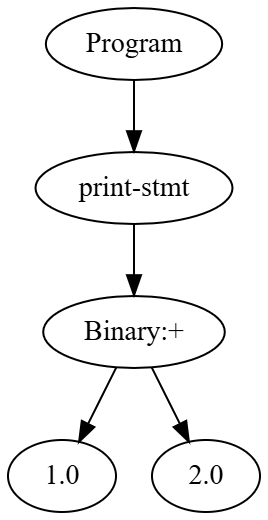
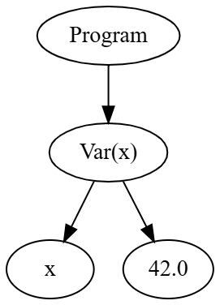
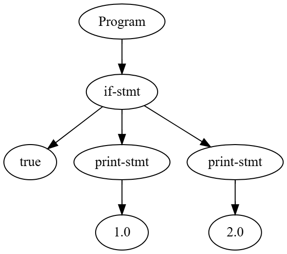
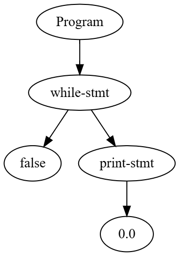
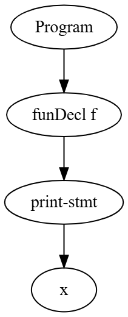
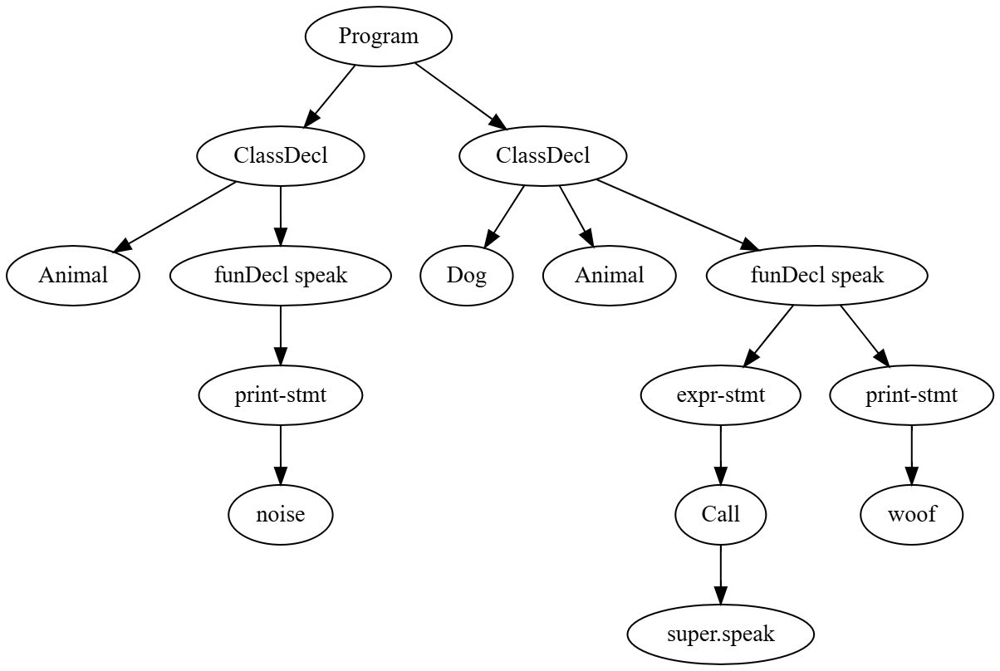
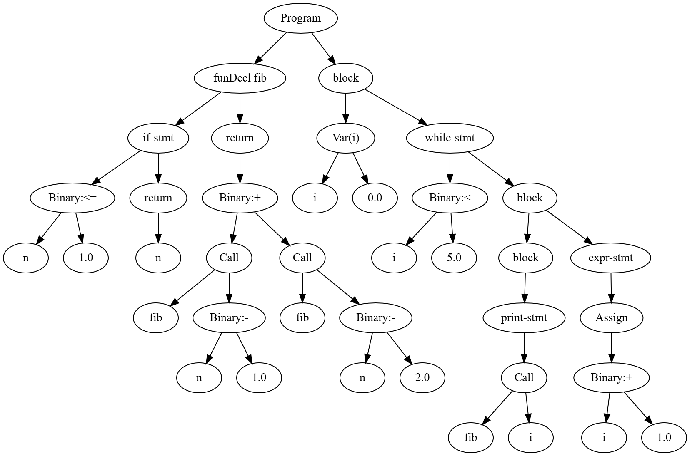
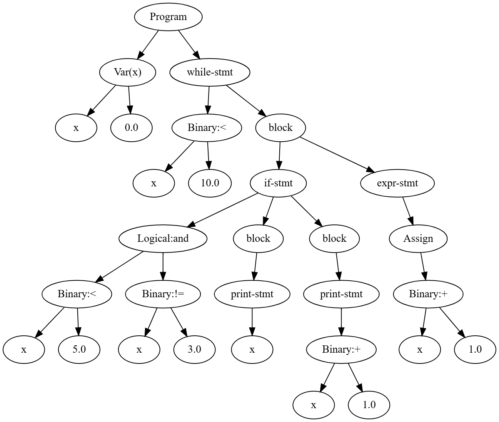

# 2_parser – Parser-Combinators
## Ziel der Aufgabe

In diesem Schritt wird der Parser als Parser-Combinator-System implementiert. Statt imperativer Grammatikfunktionen entstehen kombinierbare Parser-Bausteine, die einen typsicheren abstrakten Syntaxbaum (AST) aus Expr- und Stmt-Knoten erzeugen.


## 1. Überblick und Einordnung

### 1.1 Was macht der Parser?

Der Parser nimmt eine **Liste von Tokens** (Ausgabe des Scanners) entgegen und erzeugt einen **Abstrakten Syntaxbaum (AST)**. Der AST repräsentiert die **Struktur** des Programms (welche Deklarationen, Statements und Ausdrücke vorkommen), nicht die konkrete Zeichenkette.

- **Eingabe:** `List<Token>` (von `Scanner.tokenize()`)
- **Ausgabe:** `Stmt.Program` bzw. `List<Stmt>` – Wurzel des AST mit allen Deklarationen/Statements

### 1.2 Stellung in der Pipeline

```
Quelltext  -> Scanner  -> Tokens  ->  Parser  ->  AST  ->  (später: Transpiler/VM/Compiler)
```

Der Parser baut auf dem **Scanner** (`Scanner.java`) auf: `Token` und `TokenType` kommen aus dem Scanner; der Parser nutzt sie nur noch.

### 1.3 Besonderheit: Parser-Kombinatoren

- **Parser** sind Objekte vom Typ `Parser<T>`, die eine Token-Liste lesen und ein `Result<T>` zurückgeben.
- Parser werden aus **kleinen Bausteinen** (z. B. `Item`, `Or`, `And`, `Many`) **kombiniert**.
- Die Grammatik ist dadurch direkt im Code ablesbar und gut erweiterbar.

---

## 2. Architektur: Zwei Welten

In `ParserMain.java` gibt es im Wesentlichen **zwei große Bereiche**:

1. **AST-Definitionen** – Knotentypen für den Syntaxbaum (`AstNode`, `Expr`, `Stmt`, Hilfsknoten).
2. **Parser-Framework** – generische Parser-Typen, Result, und Kombinatoren (`Parser<T>`, `Result`, `Item`, `Or`, `And`,`Many`, `Maybe`).

Die **Klasse `ParserMain`** verbindet beides: Sie hält die Token-Liste und definiert die **konkrete Grammatik** für Lox (z. B. `program()`, `declaration()`, `parseExpression()`), indem sie die Kombinatoren verwendet.

---

## 3. AST (Abstrakter Syntaxbaum)

### 3.1 Wurzel-Interface: `AstNode`

Jeder Knoten im Baum implementiert:

```text
interface AstNode {
    List<AstNode> children();  // Kindknoten (für Baumtraversierung, z. B. DOT-Export)
    String label();            // Anzeige-Label (z. B. für Visualisierung)
}
```

Damit kann der Baum einheitlich traversiert werden (z. B. in `AstDot.toDot()`).

### 3.2 Ausdrücke: `Expr`

`Expr` ist ein **sealed Interface**: Es gibt eine feste Menge von Implementierungen. Jede Regel der Ausdrucks-Grammatik wird durch einen Record-Typ abgebildet.

| Record | Bedeutung | Kinder (inhaltlich) |
|--------|-----------|---------------------|
| `Expr.Literal` | Zahl, String, true/false/nil | keine |
| `Expr.Variable` | Bezeichner (Variable) | keine |
| `Expr.Unary` | `!` oder `-` + rechter Operand | 1 (rechter Operand) |
| `Expr.Binary` | links Operator (z. B. `+`, `*`, `==`) rechts  | 2 (links, rechts) |
| `Expr.Logical` | `and` / `or` (kurzschlussauswertung) | 2 |
| `Expr.Grouping` | `( Ausdruck )` | 1 (der eingeklammerte Ausdruck) |
| `Expr.Call` | Funktionsaufruf: Callee + Argumente | Callee + Argument-Exprs |
| `Expr.Get` | Property-Zugriff: Objekt `.` Bezeichner | 1 (Objekt) |
| `Expr.Set` | Property-Zuweisung: Objekt `.` Bezeichner `=` Wert | 2 (Objekt, Wert) |
| `Expr.Assign` | Zuweisung an Variable oder Property | 1 (Wert) |
| `Expr.This` | Schlüsselwort `this` | keine |
| `Expr.Super` | `super.Methodenname` (Vererbung) | keine |

Die **Präzedenz** der Operatoren wird nicht im AST gespeichert, sondern durch die **Reihenfolge der Parser-Regeln** (siehe Abschnitt 6) festgelegt.

### 3.3 Statements: `Stmt`

Ebenso ist `Stmt` ein **sealed Interface** mit fester Menge an Implementierungen:

| Record | Bedeutung | typische Kinder |
|--------|-----------|------------------|
| `Stmt.Expression` | Ausdrucks-Statement (Expr + `;`) | 1 (Expr) |
| `Stmt.Print` | `print Expr;` | 1 (Expr) |
| `Stmt.Var` | `var name = Expr;` (Initializer optional) | Name (Token) + ggf. Expr |
| `Stmt.Block` | `{ ... }` | Liste von Statements |
| `Stmt.If` | `if (Cond) then [else elseBranch]` | Condition, thenBranch, optional elseBranch |
| `Stmt.While` | `while (Cond) body` | Condition, body |
| `Stmt.Return` | `return [Expr];` | optional Expr |
| `Stmt.Function` | Funktionsdeklaration (Name, Parameter, Block) | Block-Inhalt (Statements) |
| `Stmt.Class` | Klassendeklaration (Name, optional Superklasse, Methoden) | Name, ggf. Superklasse, Methoden |
| `Stmt.Program` | Wurzel: Programm = Liste von Deklarationen | alle Top-Level-Deklarationen |

Hilfsknoten für die Parser-Interna (nicht für die Lox-Semantik):

- **`TokenNode(Token)`** – wrappert ein Token als `AstNode` (z. B. für `Item`-Ergebnisse).
- **`ListAstNode(List<AstNode>)`** – Liste von Knoten, z. B. Ergebnis von `And`/`Many`.
- **`Pair<A,B>`** – für Operator + Operand-Paare bei linksassoziativen Ketten.

---

## 3.4 Exemplarische AST-Strukturen


Die Bilder in diesem Ordner zeigen **Abstrakte Syntaxbäume** zu kleinen Lox-Programmen aus ParserTest.java. Sie unterstützen das Verständnis dafür, wie der Parser aus Tokens eine Baumstruktur erzeugt.

### Wie entstehen die Bilder?

1. Ein Lox-Quelltext wird mit `ParserMain.fromSource(source)` geparst.
2. `parser.toDot()` liefert eine **DOT**-Beschreibung des AST (für Graphviz).
3. Mit einem Tool wie `dot -Tpng datei.dot -o datei.png` entsteht das Bild.


### Übersicht: Einzelne Konstrukte

| Bild | Inhalt | Erklärung |
|------|--------|-----------|
| **print_dot.png** | `print 1 + 2;` | Programm → print-stmt → Binary:+ mit zwei Literal-Kindern (1.0, 2.0). Zeigt die Präzedenz: Der Plus-Operator ist Wurzel des Ausdrucks, die Zahlen sind Blätter. |
| **var_dot.png** | `var x = 42;` | Programm -> Var(x) mit Kindern: Variablenname (x) und Initializer (Literal 42.0). Typisch für **varDecl**. |
| **if_else_dot.png** | `if (true) print 1; else print 2;` | if-stmt mit drei Kindern: Bedingung (true), then-Branch (print 1), else-Branch (print 2). Verzweigung im Baum sichtbar. |
| **while_dot.png** | `while (cond) body` | while-stmt mit zwei Kindern: Condition und Body-Statement. Entspricht der Grammatik **whileStmt**. |
| **fun_dot.png** | `fun f(x) { print x; }` | funDecl mit Namen und Block; im Block die Statements (hier ein print-stmt). Zeigt die Struktur von **Stmt.Function**. |
| **Class_dot.png** | `class Name { method() { } }` | ClassDecl mit Klassenname, optional Superklasse und Methoden (jeweils als funDecl). Zeigt die Struktur von **Stmt.Class**. |
| **testMiniProgram.png** | Kleines vollständiges Programm | Mehrere Deklarationen/Statements unter einer Program-Wurzel. Gut geeignet, um die Top-Level-Struktur (declaration*) zu sehen. |
| **testNestedControlFlow.png** | Verschachtelte Kontrollstrukturen | if/while/for oder Blöcke ineinander. Zeigt, wie **block** und **statement** rekursiv im Baum vorkommen. |

### Einbindung der Bilder 

**Beispiel: print-Statement**



*Abb.: Programm mit einem print-Statement; der Ausdruck ist ein Binary (Plus) mit zwei Literalen.*

**Beispiel: Variablendeklaration**



*Abb.: Var-Knoten mit Namen und optionalem Initializer (hier Literal 42).*

**Beispiel: if-else**



*Abb.: if-stmt mit Bedingung, then-Branch und else-Branch als Kinder.*

**Beispiel: while-Schleife**



*Abb.: while-stmt mit Condition und Body.*

**Beispiel: Funktionsdeklaration**



*Abb.: funDecl mit Name, Parameterliste (im Block-Kontext) und Block als Kind.*

**Beispiel: Klassendeklaration**



*Abb.: ClassDecl mit Klassenname, optionaler Superklasse und Liste von Methoden.*

**Beispiel: Kleines Programm (mehrere Deklarationen)**



*Abb.: Program-Wurzel mit mehreren Kindern (Deklarationen/Statements).*

**Beispiel: Verschachtelte Kontrollstrukturen**



*Abb.: Verschachtelte Strukturen zeigen die rekursive Anwendung von block und statement.*

---

## 4. Parser-Framework: Kombinatoren und Result

### 4.1 Typ `Parser<T>`

```text
sealed interface Parser<T extends AstNode> {
    Result<T> parse(List<Token> tokens);
    // + map, flatMap als Default-Methoden
}
```

- Ein Parser **konsumiert** einen Anfangsabschnitt der Token-Liste und liefert:
  - **Erfolg:** ein erkanntes Objekt vom Typ `T` und die **restlichen** Tokens.
  - **Misserfolg:** keine Erkennung; die übergebene Token-Liste wird unverändert als „Rest“ zurückgegeben (Backtracking kann an anderer Stelle mit dem gleichen Rest weiterprobieren).

### 4.2 Result

```text
record Result<T>(boolean success, Optional<T> recognized, List<Token> rest)
```

- **success:** ob der Parser erfolgreich war.
- **recognized:** das erkannte AST-Element (nur bei Erfolg gesetzt).
- **rest:** die Token-Liste **nach** dem erkannten Stück.

Hilfsmethoden: `Result.of(value, rest)`, `Result.fail(rest)`, `hasFailed()`, `hasNotFailed()`.

### 4.3 Die elementaren Kombinatoren

| Kombinator | Typ / Bedeutung | Verhalten |
|------------|------------------|-----------|
| **Item(TokenType)** | `Parser<TokenNode>` | Liest **genau ein** Token des angegebenen Typs. Bei Übereinstimmung: Erfolg + Rest = Rest der Liste; sonst: Fail. |
| **Or(Parser<T>...)** | `Parser<T>` | Probiert die Parser der Reihe nach. Erster Erfolg wird zurückgegeben; wenn alle scheitern: Fail. |
| **And(Parser<?>...)** | `Parser<ListAstNode>` | Führt alle Parser **hintereinander** aus. Bei Erfolg: Liste der erkannten Knoten (in Reihenfolge) + gemeinsamer Rest. Sobald einer scheitert: Fail. |
| **Many(Parser<T>)** | `Parser<ListAstNode>` | Wendet den Parser **beliebig oft** an (0-mal oder öfter). Sammelt alle erkannten Knoten in einer Liste. Stoppt, wenn der Parser das erste Mal scheitert. Enthält eine **Guard** gegen Endlosschleifen: Wenn kein Token verbraucht wird, wird abgebrochen. |
| **Maybe(Parser<T>)** | `Parser<T>` | Entspricht „0- oder 1-mal“: `Or(parser, Success())`. Erfolg mit Wert oder „leerer“ Erfolg (null). |
| **Drop(Parser<T>)** | `Parser<T>` | Führt den Parser aus, verwirft aber das Ergebnis und liefert nur Erfolg + Rest (nützlich, wenn man nur Tokens „verbrauchen“ will). |
| **Success** | `Parser<T>` | Verbraucht keine Tokens, liefert immer Erfolg mit `recognized = null`. |
| **MapParser** | `Parser<R>` | Führt einen Parser aus und wendet eine Funktion auf das Ergebnis an (Transformation des AST-Knotens). |
| **FlatMap** | `Parser<R>` | Führt einen Parser aus; das Ergebnis geht in eine **Funktion**, die einen **weiteren Parser** liefert, der auf dem **Rest** ausgeführt wird. Wichtig für **abhängige** Regeln (z. B. „erst primary, dann beliebig viele Suffixe“). |
| **Lazy** | `Parser<T>` | Wrappert eine `Supplier<Parser<T>>`. Der innere Parser wird erst bei der ersten `parse`-Ausführung erzeugt. **Notwendig für rekursive Grammatiken**, damit z. B. `statement()` auf `declaration()` verweisen kann, ohne sofort zirkuläre Objekte zu bauen. |

### 4.4 Warum Lazy?

Ohne `Lazy` würden z. B. `program() -> declaration() -> statement() -> … -> block() -> declaration()` sofort alle Parser-Objekte aufbauen und dabei zirkuläre Referenzen erzeugen. Mit `lazy(() -> new Or<>(…))` wird der innere Parser erst beim ersten Aufruf von `parse()` erzeugt . Die Rekursion funktioniert dann zur Laufzeit.

---

## 5. Grammatik: Top-Down-Struktur

Die Lox-Grammatik ist in `ParserMain` von **oben nach unten** abgebildet.

### 5.1 Programm und Deklarationen

- **program** -> `declaration* EOF`  
  - Erkannt durch: `many(declaration())` und dann `item(EOF)`. Das Ergebnis von `many` wird per `mapProgram` in ein `Stmt.Program` überführt.

- **declaration** -> **classDecl** | **funDecl** | **varDecl** | **statement**  
  - Entspricht einem `Or` aus diesen vier Parsern. Damit sind Klassen, Funktionen, Variablen und „normale“ Statements (inkl. Blöcke) Top-Level möglich.

### 5.2 Klassen und Funktionen

- **classDecl** → `class` IDENTIFIER [`<` IDENTIFIER] `{` function* `}`  
  - Optional: Superklasse via `superClassOpt` (`maybe(listItem(LESS, IDENTIFIER))`).  
  - Die Methoden sind `Stmt.Function` (ohne `fun`-Keyword im Rumpf).

- **funDecl** -> `fun` function  
- **function** (Methoden- oder Funktionsrümpfe) -> IDENTIFIER `(` parameters? `)` block  
- **parameters** → IDENTIFIER (`,` IDENTIFIER)*  
- **block** → `{` declaration* `}`  

### 5.3 Statements

- **varDecl** -> `var` IDENTIFIER `=` expression? `;`
- **exprStmt** -> expression `;`
- **printStmt** -> `print` expression `;`
- **returnStmt** -> `return` expression? `;`
- **ifStmt** -> `if` `(` expression `)` statement `else` statement?
- **whileStmt** -> `while` `(` expression `)` statement
- **forStmt** -> wird **desugared**: in Initializer, Bedingung, Inkrement und Body übersetzt und als Kombination aus `Stmt.While`/`Stmt.Block`/`Stmt.Expression` abgebildet (`mapForStmt`).
- **statement** -> exprStmt | forStmt | ifStmt | printStmt | returnStmt | whileStmt | block

### 5.4 Ausdrücke: Präzedenz (von niedrig nach hoch)

Die Ausdrucks-Grammatik ist so geschrieben, dass **höhere Präzedenz** durch **tiefere** (später aufgerufene) Parser realisiert wird:

1. **assignment** -> logicOr, optional gefolgt von `=` und erneut assignment (rechtsassoziativ).  
   - Zuweisung erzeugt `Expr.Assign` (Variable) oder `Expr.Set` (Property); sonst bleibt der linke Ausdruck unverändert.

2. **logicOr** → logicAnd (`or` logicAnd)*  
3. **logicAnd** → equality (`and` equality)*  
4. **equality** → comparison (`==` | `!=` comparison)*  
5. **comparison** → term (`<` | `<=` | `>` | `>=` term)*  
6. **term** -> factor (`+` | `-` factor)*  
7. **factor** -> unary (`*` | `/` unary)*  
8. **unary** -> `!` unary | `-` unary | **call**  
9. **call** -> primary (Aufruf-Suffix oder Property-Suffix)*  
   - **callSuffix:** `(` arguments? `)` -> `Expr.Call`, oder `.` IDENTIFIER -> `Expr.Get`.  
   - Mehrere Suffixe werden linksassoziativ angewendet: `primary().flatMap(callee -> many(callSuffix()).map(…))` mit `applySuffix(expr, suffix)`.

10. **primary** -> Literale (Zahl, String, true/false/nil), `this`, IDENTIFIER, `super`.`IDENTIFIER`, oder `(` expression `)`.

**Linksassoziativität** für binäre Operatoren (und für Call-Ketten) wird durch die Hilfsmethode **`binaryLeftAssoc(operand, operator, nextOperand, isBinary)`** umgesetzt:

- Sie parst den ersten Operanden und dann `many(And(operator, nextOperand))`.
- Die entstehenden (Operator, rechter Operand)-Paare werden in einer Schleife von links nach rechts abgearbeitet und zu `Expr.Binary` bzw. `Expr.Logical` zusammengebaut.

---

## 6. Wichtige Implementierungsdetails

### 6.1 Mapper-Methoden

Die `And`-Kombinator liefert eine **Liste** von Knoten. Die konkrete AST-Erzeugung erfolgt in **Mapper-Methoden**, die per `.map(this::mapX)` an den Parser gehängt werden, z. B.:

- `mapProgram(ListAstNode)` -> erzeugt `Stmt.Program` aus der Liste der Deklarationen.
- `mapClassDecl`, `mapFunction`, `mapBlock`, `mapVarDecl`, `mapForStmt`, `mapAssignment` usw.

Darin wird per Index auf die Liste zugegriffen (z. B. `expr(list, 0)`, `stmt(list, 4)`) und der passende Record gebaut.

### 6.2 Call und Suffixe

- **call** = primary + beliebig viele **callSuffix** (Funktionsaufruf oder Property-Zugriff).
- `functionCallSuffix` liefert ein „Template“-`Expr.Call` mit `callee = null`; `propertyAccessSuffix` ein `Expr.Get` mit `object = null`.  
- **applySuffix(callee, suffix)** setzt dann den aktuellen Ausdruck als Callee/Objekt ein und baut so Ketten wie `a().b().c()` korrekt auf.

### 6.3 For-Schleife

Die **for**-Schleife wird nicht als eigener AST-Knoten gespeichert, sondern in **while + block** übersetzt:

- Initializer (varDecl oder exprStmt oder leer),
- Bedingung (default: `true`),
- Inkrement (am Ende des Schleifenkörpers als weiteres Statement),
- Body.

`mapForStmt` setzt diese Teile zu einem oder mehreren `Stmt.Block` und einem `Stmt.While` zusammen.

---

## 7. Öffentliche API und Verwendung

### 7.1 Erzeugung

- **`ParserMain.fromSource(String source)`**  
  Erstellt Tokens via `new Scanner(source).tokenize()` und liefert eine `ParserMain`-Instanz mit dieser Token-Liste.

- **`new ParserMain(List<Token> tokens)`**  
  Direkte Konstruktion mit vorgegebener Token-Liste.

### 7.2 Parsing

- **`program().parse(tokens)`**  
  Liefert `Result<Stmt.Program>`. Bei Erfolg enthält `recognized()` das komplette Programm als AST-Wurzel.

- **`parseProgram(String source)`** (statisch)  
  Bequememethode: Quelle -> Scanner -> Parser -> bei Erfolg `List<Stmt>` (die Deklarationen), bei Fehler leere Liste und Fehlerausgabe auf stderr.

### 7.3 Visualisierung (DOT)

- **`toDot()`**  
  Parst die gespeicherten Tokens mit `program()` und wandelt das `Stmt.Program` mit `AstDot.toDot(root)` in eine DOT-String-Repräsentation um (für Graphviz).

- **`printDot()`**  
  Gibt diesen String auf der Konsole aus.

Die Klasse **AstDot** (am Ende der Datei) traversiert den AST über `children()` und `label()` und schreibt die Kanten und Knoten im DOT-Format. `ListAstNode` wird „transparent“ behandelt (kein eigener Knoten, nur die Kinder werden angehängt).

---
## 8 Technische Erkenntnisse

### 8.1 Typsicherheit der Parser-Signatur
Die ursprüngliche Parser-Signatur war zu allgemein gefasst, was beim Zusammenführen mehrerer Parser-Ergebnisse zu Typunsicherheiten und expliziten Cast-Operationen führte.
Durch die Einschränkung auf `Parser<T extends AstNode>` konnte die Typstruktur präzisiert werden.  
Dies ermöglichte eine statische Absicherung der AST-Erzeugung und eliminierte die Notwendigkeit unsicherer Casts vollständig.
Die Anpassung erhöhte sowohl die Wartbarkeit als auch die Robustheit der Parser-Implementierung.

### 8.2 Einsatz von KI-Werkzeugen
KI-Werkzeuge wurden unterstützend zur sprachlichen Überarbeitung .
Die konzeptionelle Ausarbeitung, das Parser-Design sowie die vollständige Implementierung des Systems wurden eigenständig entwickelt.

## Zusammenfassung

Der Parser kombiniert sealed-Hierarchien, Records und funktionale Parser-Combinators zu einer modularen, erweiterbaren Syntaxanalyse. Grammatik, AST-Erzeugung und Visualisierung sind klar getrennt und bleiben dennoch eng verzahnt.

## 9. Grammatik-Referenz (BNF-ähnlich)

```text
program        → declaration* EOF
declaration    → classDecl | funDecl | varDecl | statement
classDecl      → "class" IDENTIFIER [ "<" IDENTIFIER ] "{" function* "}"
funDecl        → "fun" function
function       → IDENTIFIER "(" parameters? ")" block
parameters     → IDENTIFIER ( "," IDENTIFIER )*
block          → "{" declaration* "}"
varDecl        → "var" IDENTIFIER ( "=" expression )? ";"
statement      → exprStmt | forStmt | ifStmt | printStmt | returnStmt | whileStmt | block
exprStmt       → expression ";"
printStmt      → "print" expression ";"
returnStmt     → "return" expression? ";"
ifStmt         → "if" "(" expression ")" statement ( "else" statement )?
whileStmt      → "while" "(" expression ")" statement
forStmt        → "for" "(" ( varDecl | exprStmt | ";" ) expression? ";" expression? ")" statement

expression     → assignment
assignment     → logicOr ( "=" assignment )?
logicOr        → logicAnd ( "or" logicAnd )*
logicAnd       → equality ( "and" equality )*
equality       → comparison ( ( "!=" | "==" ) comparison )*
comparison     → term ( ( "<" | "<=" | ">" | ">=" ) term )*
term           → factor ( ( "-" | "+" ) factor )*
factor         → unary ( ( "/" | "*" ) unary )*
unary          → ( "!" | "-" ) unary | call
call           → primary ( ( "(" arguments? ")" | "." IDENTIFIER ) )*
primary        → NUMBER | STRING | "true" | "false" | "nil" | "this" | IDENTIFIER
               | "super" "." IDENTIFIER | "(" expression ")"
arguments      → expression ( "," expression )*
```

---

## Navigation
- Zurück zum Einstieg: [Compiler.md](/Compiler.md)
- Weiter zu Aufgabe 3: [3_transpiler/README.md](/3_transpiler/README.md)
