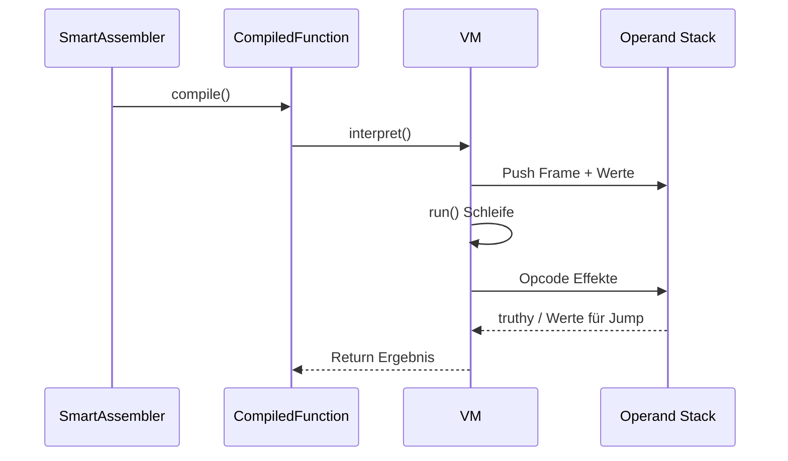

# 4_vm – SmartAssembler und Virtual Machine
  
In diesem Schritt wurde die ursprünglich in C implementierte Lox Virtual Machine durch eine Java-Implementierung ersetzt. Die neue Implementierung befindet sich in `VM.java`.
Die Java-Implementierung der Lox Virtual Machine (VM.java) wurde im Rahmen des Projekts bereitgestellt und bildet die Laufzeitumgebung für den vom Compiler erzeugten ByteCode
Zusätzlich wurde ein`SmartAssembler` (SmartAssembler.java) entwickelt. Dieser stellt eine DSL (Domain Specific Language) zur Verfügung, mit der ByteCode in textueller Form beschrieben und anschließend in ausführbaren ByteCode übersetzt werden kann.
Die Funktionsweise und das Zusammenspiel von Virtual Machine und SmartAssembler werden anhand praktischer Beispiele in `SmartAssemblerTest.java `demonstriert.

```mermaid
flowchart LR
        Source["Assembler-DSL"] -->|CompiledFunction| Bytecode[[Bytecode Objekt]]
        Bytecode -->|interpret()| VMStack[VM Stack + Frames]
        VMStack --> Effects[Seiteneffekte (IO, Globals, Felder)]
```

## 1. VM.java

### 1.1 Startpunkt interpret()
Die Methode `interpret(CompiledFunction script)` bildet den Einstiegspunkt zur Ausführung eines kompilierten Lox-Programms.
Zunächst wird aus der übergebenen CompiledFunction eine `Val.Obj.Closure `erzeugt.
Da es sich beim Skript um das Hauptprogramm handelt, besitzt diese Closure eine Arity von 0.
Anschließend wird ein erster` CallFrame` mit `slotOffset = 0 `erzeugt und auf den Frame-Stack gelegt. Dieser Frame repräsentiert den initialen Ausführungskontext des Programms.
Daraufhin wird die Methode `run()` aufgerufen, welche die zentrale Fetch-Decode-Execute-Schleife der Virtual Machine implementiert. In dieser Schleife werden die ByteCode-Instruktionen sequenziell gelesen, dekodiert und ausgeführt.
Laufzeitfehler werden nicht innerhalb der VM abgefangen, sondern als Exceptions weitergegeben und signalisieren Runtime-Fehler des ausgeführten Lox-Programms.

### 1.2 Kern-Datenstrukturen

| Struktur | Typ | Aufgabe |
| --- | --- | --- |
| stack | `List<Val>` | Operanden, Zwischenwerte, Funktionsobjekte, Argumente. Slots werden über Indizes adressiert. |
| frames | `List<CallFrame>` | Call-Stack. Jeder Frame speichert Closure, Instruction Pointer `ip` und `slotOffset`. |
| globals | `Map<String, Val>` | Speichert globale Variablen und native Funktionen. |
| openUpvalues | `List<Upvalue>` | Verwaltung offener Upvalues, die noch auf dem Stack liegen. |
| CallFrame | `static class` | Enthält `closure`, `ip`, `slotOffset`. Wird bei jedem Funktionsaufruf gepusht. |
| Upvalue | `class` | Bindet eine Stack-Position, kann spaeter in einen Heap-Wert ueberfuehrt werden (`close`). |

### 1.3 Instruction Set (Op)
Alle Opcodes sind als `record` im sealed Interface `Op` modelliert. Der Stack-Effekt beschreibt Änderungen am Operandenstack.

**Stack, Werte, IO**

| Opcode | Stack-Effekt | Beschreibung |
| --- | --- | --- |
| `Const(value)` | push 1 | Legt Literal-Wert auf den Stack. |
| `Nil` / `True` / `False` | push 1 | Convenience-Konstanten. |
| `Pop` | pop 1 | Entfernt oberstes Stack-Element. |
| `Print` | pop 1 | Gibt oberstes Element auf `System.out` aus. |

**Arithmetik und Logik**

| Opcode | Stack-Effekt | Beschreibung |
| --- | --- | --- |
| `Add` | pop 2, push 1 | Addition für Zahlen oder Konkatenation für Strings. |
| `Sub`, `Mul`, `Div` | pop 2, push 1 | Numerische Operationen. Typpruefung auf `Val.Num`. |
| `Neg` | pop 1, push 1 | Unares Minus. |
| `Not` | pop 1, push 1 | Boolesche Negation mit Truthiness-Regel. |

**Vergleich**

| Opcode | Stack-Effekt | Beschreibung |
| --- | --- | --- |
| `Equal` | pop 2, push 1 | Vergleich zweier Werte mit Spezialfall fuer `Val.Num`. |
| `Greater`, `Less` | pop 2, push 1 | Numerische Vergleiche. |

**Lokale, globale, Upvalues**

| Opcode | Stack-Effekt | Beschreibung |
| --- | --- | --- |
| `GetLocal(slot)` | push 1 | Kopiert Wert aus Stack-Position `slotOffset + slot`. |
| `SetLocal(slot)` | keine | Schreibt oberstes Element in lokalen Slot (Lvalue bleibt auf dem Stack). |
| `DefGlobal(name)` | pop 1 | Initialisiert globale Variable. |
| `SetGlobal(name)` | keine | Aktualisiert globalen Namen (Stack-Top bleibt für Ausdruckswert). |
| `GetGlobal(name)` | push 1 | Liest globalen Namen. |
| `GetUpval(index)` / `SetUpval(index)` | push 1 / keine | Zugriff auf Captured-Variablen in Closures. |
| `CloseUpval` | pop 1 | Schliesst Upvalues für oberstes Stack-Element. |

**Kontrollfluss**

| Opcode | Stack-Effekt | Beschreibung |
| --- | --- | --- |
| `Jump(offset)` | keine | Erhöht `ip` um `offset`. Ziel ist relative Offset-Position. |
| `JumpIfFalse(offset)` | keine | Prüft Truthiness des Stack-Tops. Bei `false` springt `ip` um `offset`. Wert bleibt auf dem Stack. |
| `Loop(offset)` | keine | Zieht `offset` von `ip` ab. Implementiert Rücksprung für Schleifen. |

**Funktionen und Aufrufe**

| Opcode | Stack-Effekt | Beschreibung |
| --- | --- | --- |
| `Closure(fn, upvalues)` | push 1 | Erzeugt `Val.Obj.Closure` und captured Upvalues. |
| `Call(args)` | variabel | Liest Callee bei `stack.size() - 1 - args` und führt Dispatch in `callValue`. |
| `Invoke(name, args)` | variabel | Methodenaufruf auf Instanzen mit direktem Dispatch. |
| `SuperInvoke(name, args)` | variabel | Aufruf von Superklassen-Methoden. |
| `Return` | variabel | Liefert oberstes Element als Ergebnis, schliesst Upvalues, poppt Frame. |

**Objektmodell**

| Opcode | Stack-Effekt | Beschreibung |
| --- | --- | --- |
| `Class(name)` | push 1 | Erzeugt `Val.Obj.Klass` ohne Methoden. |
| `Inherit` | pop 1 | Kopiert Methoden der Superklasse in Subklasse. |
| `Method(name)` | pop 1 | Nimmt Closure vom Stack und registriert sie als Methode der Klasse auf Stack-Top. |
| `GetProp(name)` | pop 1, push 1 | Liest Instanzfeld oder bindet Methode (BoundMethod). |
| `SetProp(name)` | pop 2, push 1 | Schreibt Feld und lässt Wert auf Stack. |
| `GetSuper(name)` | pop 2, push 1 | Bindet geerbte Methode an Receiver (BoundMethod). |

### 1.4 Werttypen (Val)
- `Val.Nil`, `Val.Bool`, `Val.Num`, `Val.Str` bilden die Grundtypen. Zahlen werden ohne Nachkommastellen formatiert, wenn moeglich.
- `Val.Obj` kapselt komplexe Werte:
    - `Closure` enthält `CompiledFunction` plus Array von `Upvalue`.
    - `Native` repräsentiert hostseitige Funktionen mit Arity-Prüfung.
    - `Klass` hält Methodentabelle (`Map<String, Closure>`).
    - `Instance` speichert Felder (`Map<String, Val>`) und führt Methoden-Bindung durch.
    - `BoundMethod` transportiert Receiver plus Closure für spätere Aufrufe.
- Truthiness: Nur `Nil` und `Val.Bool(false)` gelten als falsch, alles andere als wahr.

### 1.5 Ausführungsschleife run()
- Innerhalb der `while`-Schleife wird per `frame.ip++` der nächste Opcode geladen.
- Die `switch`-Expression implementiert alle Seiteneffekte direkt, wodurch kein Visitor notwendig ist.


### 1.6 Funktionsaufrufe und Frames
- `callValue` unterscheidet vier Callables: BoundMethod, Closure, Klass (als Konstruktor) und Native.
- BoundMethod ersetzt vor dem Aufruf den Platz des Callables durch den Receiver, damit Slot 0 des neuen Frames korrekt ist.
- `callClosure` prüft Arity und pusht neuen Frame mit `slotOffset = stack.size() - 1 - argc`. Dieser Offset verweist auf den Slot, an dem die Closure selbst liegt.
- `Return` entfernt den aktuellen Frame, schliesst alle Upvalues ab `slotOffset` und legt das Resultat auf den Caller-Stack.

### 1.7 Closures und Upvalues
- `captureUpvalue` sucht nach bereits offenen Upvalues mit gleicher `location`. Dadurch teilen sich Closures, die dieselbe Variable capturen, eine Instanz.
- `closeUpvalues(lastIndex)` iteriert über `openUpvalues` und kopiert Werte vom Stack in die `Upvalue.closed`-Speicherzelle, sobald der Stack-Eintrag den Rahmen verlaesst.
- In `Closure`-Opcode werden `UpvalueDescriptor` verarbeitet. `isLocal=true` bedeutet, dass `frame.slotOffset + index` auf eine lokale Variable im aktuellen Frame zeigt.

### 1.8 Objektmodell und OOP-Opcodes
- `Class` erzeugt eine leere Klasse; der Assembler sorgt dafür, dass das Ergebnis in eine Variable geschrieben wird.
- `Method` erwartet, dass auf dem Stack die Klasse (peek) und die neue Methode (top) liegen. Nach dem Eintrag verbleibt die Klasse auf dem Stack, damit weitere Methoden folgen können.
- `GetProp` prüft zuerst Instanzfelder, erst danach Methoden. Methoden werden als `BoundMethod` zurückgegeben, was später von `callValue` erkannt wird.
- `Invoke` realisiert direkten Methodenaufruf: Die Instanz verbleibt an ihrem Stack-Platz, sodass `callClosure` sie als Slot 0 interpretiert.
- `SuperInvoke` und `GetSuper` arbeiten mit Klassenobjekten, die der Assembler auf den Stack legt (z.B. über `getSuper`).

### 1.9 Kontrollfluss und Spruenge
- `Jump` und `JumpIfFalse` nutzen Offsets in Anzahl der Opcodes. Der Assembler muss deshalb nach der Codegenerierung patchen.
- `Loop` realisiert Rücksprünge. Der Offset wird so gewählt, dass `frame.ip -= offset` zum Schleifenanfang führt.
- `JumpIfFalse` lässt das geprüfte Value auf dem Stack, damit der Expression-Wert in Lox weiterhin verfügbar bleibt.

### 1.10 Fehlerbehandlung
- Fehler werden als `RuntimeException` geworfen. Beispiele: falsche Arity, undefinierte Variablen, Typfehler bei Arithmetik oder Feldzugriffen.
- Die Fehlermeldungen enthalten den betreffenden Namen oder Operator, was fuer Debugging der Assembler-Ausgabe wichtig ist.

### 1.11 Durchlauf: testControlFlow()
Das Beispiel aus VM.java erstellt folgenden Bytecode:

1. `Const "Start"`, `Print` -> Ausgabe "Start".
2. `False`, `JumpIfFalse 2` -> boolean bleibt auf Stack, Offset ueberspringt zwei Opcodes.
3. `Const "Skip"`, `Print` -> wird wegen JumpIfFalse übersprungen.
4. `Const "Ende"`, `Print` -> Ausgabe "Ende".
5. `Nil`, `Return` -> Abschluss des Skripts.


## 2. SmartAssembler.java

### 2.1 Zielsetzung

Der SmartAssembler bietet eine fluent API, die die Erzeugung von ByteCode stark vereinfacht.
Er verwaltet automatisch:
- Scope-Informationen
- Slot-Zuteilung für lokale Variablen
- Upvalue-Tracking für Closures
- Jump-Patching für Kontrollfluss-Anweisungen
Am Ende erzeugt `compile() `eine ``CompiledFunction`, die das fertige ByteCode-Skript repräsentiert.

### 2.2 CompilerState und Lebenszyklus

Der SmartAssembler verwaltet einen Stack von CompilerStates (Deque<CompilerState> compilers), wobei jeder CompilerState den aktuellen Funktions-Compiler repräsentiert.
Ein CompilerState enthält:
- List<Op> code :die bisher erzeugten Instruktionen
- List<Local> locals : lokale Variablen mit Name, Tiefe und Flag isCaptured
- List<UpvalueDescriptor> upvalues :für spätere Closure-Operationen
- scopeDepth : die aktuelle Verschachtelungsebene
- FunctionType :entweder `SCRIPT`, `FUNCTION` oder `METHOD`

Der Konstruktor startet mit einem initialen `CompilerState(null, SCRIPT)` für das Hauptprogramm.

### 2.3 Namensauflösung
Variablen werden je nach Scope automatisch lokal oder global angelegt:
- Lokal: Es wird ein Local hinzugefügt und `Op.SetLocal ` geschrieben.
- Global: Der Name wird in globals vermerkt, und `Op.DefGlobal `wird emittiert.
Zugriff auf Variablen (`get(name)` / `set(name)`) erfolgt über `namedVariable(name, canAssign)`:
1. Suche im aktuellen `CompilerState.locals` (rückwärts, nächster Scope zuerst)
2. Falls nicht gefunden, rekursives `resolveUpvalue` über verschachtelte CompilerStates
3. Sonst globale Variable; Fehler, wenn Zuweisung nicht erlaubt (`canAssign=false`) und Name unbekannt

### 2.4 Scope-Verwaltung
- beginScope() erhöht die scopeDepth
- endScope() verringert `scopeDepth` und entfernt alle Locals mit größerer Tiefe
  - Für captured Variablen wird `Op.CloseUpval` emittiert, anschließend `Op.Pop`, um den Stack korrekt zu bereinigen

- scope(Consumer<SmartAssembler>) automatisiert Begin/End für Block-Konstrukte

## 2.5 Kontrollfluss-Builder
Jump-und Loop-Instruktionen werden abstrahiert:
- `emitJumpIfFalse()` / `emitJump()` erzeugen Platzhalter und geben die Position zurück
- `patchJump(pos)` berechnet die echten Offsets und ersetzt Platzhalter
- Loops:` emitLoopStart()` merkt den Startindex, `emitLoop (loopStart)` erzeugt `Op.Loop`

- High-Level Builder:
  - `whileLoop(condition, body)` kapselt das gesamte Muster (LoopStart, Condition, JumpExit, Body, Loop, PatchExit)
  - `ifThenElse(condition, thenBranch, elseBranch)` verwendet JumpIfFalse und optionalen Jump über Else
  - `and / or` implementieren Kurzschluss-Logik mit Jumps

### 2.6 Funktionen und Closures
- `fun(name, params, body)` erzeugt einen neuen CompilerState mit `FunctionType.FUNCTION`
  - Slot 0 reserviert für Callee, danach folgen Parameter
  - Body wird im neuen Compiler-Context erzeugt
  - Fehlt am Ende ein Op.Return, fügt der Builder Nil + Return nach
  - Nach Pop des Funktions-Compilers wird `Op.Closure `emittiert, anschließend `var(name)` aufgerufen, um eine Referenz zu behalten

- `method(name, paramNames, body) funktioniert wie ` `fun`, fügt jedoch automatisch `this` als Local Slot 0 hinzu und emittiert abschließend `Op.Method`

### 2.7 Klassen und Vererbung
Der SmartAssembler unterstützt die vollständige Abbildung des Lox-Klassenmodells auf ByteCode-Ebene. Dabei werden sowohl Klassenobjekte als auch Vererbungsbeziehungen korrekt generiert.

- `classDecl(name, body)`:
   - Reserviert einen globalen Namen,
   - erzeugt mittels `Op.Class` ein Klassenobjekt,
   - speichert dieses global,
   - und generiert anschließend den Methoden-Body.
- `classDecl(name, superClassName, body)` erweitert diesen Ablauf um Vererbungslogik:
 - Die Superklasse wird geladen.
 - Sie wird als lokale Variable `super` im aktuellen Scope registriert.
 - Op.Inherit kopiert die Methoden der Basisklasse in die neue Klasse.
 - Nach der Klassendefinition wird der Scope für `super` wieder geschlossen.
`getSuper(method)` erzeugt `Op.GetSuper`, welches zur Laufzeit eine`BoundMethod` erstellt.
`superInvoke(name, args)` kombiniert dies mit `Op.SuperInvoke`, um Methoden der Oberklasse direkt aufzurufen.

Damit wird sichergestellt, dass:
- this korrekt gebunden bleibt,
- Methoden dynamisch aufgelöst werden,
- und das Lox-Vererbungsmodell vollständig auf ByteCode-Ebene realisiert wird.

### 2.8 Hilfsfunktionen für Tests
Für Testzwecke stellt der SmartAssembler Hilfsmethoden bereit:
- `buildAsm` erzeugt eine CompiledFunction aus einer DSL-Beschreibung.
- `runTest` kompiliert und führt das erzeugte ByteCode-Programm direkt aus.
- `printBytecode` listet sämtliche Opcodes einer `CompiledFunction` auf und ermöglicht so eine strukturierte Analyse der Codegenerierung.
Diese Funktionen erleichtern das Debugging sowie die Nachvollziehbarkeit der ByteCode-Erzeugung.

### 2.9 Beispielanalyse: testWhile()

Beispiel aus SmartAssemblerTest.java:
```java
SmartAssembler.runTest("testWhile", a -> {
        a.const_(new Val.Num(0)).var("i");
        int loopStart = a.emitLoopStart();
        a.get("i").const_(new Val.Num(3)).lt();
        int exitJump = a.emitJumpIfFalse();
        a.get("i").print();
        a.get("i").const_(new Val.Num(1)).add().set("i");
        a.emitLoop(loopStart);
        a.patchJump(exitJump);
});
```
**Analyse**
1. `Const 0`, `DefGlobal i` : Initialisierung der Schleifenvariable.
2. Vergleich `i < 3`  erzeugt ein `Val.Bool`.
3. `JumpIfFalse` springt bei falscher Bedingung aus der Schleife.
4. Der Body gibt `i` aus und inkrementiert die Variable.
5. Loop setzt den Instruction Pointer auf den Beginn der Bedingung zurück.
6. patchJump ersetzt den zuvor gesetzten Platzhalter durch den korrekten Offset.

Die VM interpretiert die Schleife, indem sie:
- das Ergebnis der Bedingung auf dem Stack auswertet,
- bei false den Sprung ausführt,
- ansonsten den Body verarbeitet und zum Schleifenanfang zurückkehrt.
Nach Verlassen der Schleife sorgt die automatisch generierte Nil-Instruktion dafür, dass die Funktion einen gültigen Rückgabewert besitzt.

### 2.10 Beispielanalyse: testClosureCapture()
```java
SmartAssembler.runTest("testClosureCapture", a -> {
        a.scope(s -> {
                s.const_(new Val.Num(10)).var("y");
                s.fun("make", Arrays.asList(), mk -> {
                        mk.fun("inner", Arrays.asList(), inn -> {
                                inn.get("y").print();
                        });
                });
        });
});
```
**Analyse**

1. Der äußere Scope deklariert y als lokale Variable im Script-Frame.
2. Beim Kompilieren von make erkennt `resolveUpvalue`, dass y aus einem äußeren Scope stammt, und markiert sie als `isCaptured`.
3. Die innere Funktion `inner` übernimmt dieses Upvalue und erzeugt beim `Op.Closure` einen Verweis auf den Slot von y.
4. Beim Verlassen des äußeren Scopes emittiert `endScope` ein `CloseUpval` , wodurch y vom Stack auf den Heap verschoben wird.
5. Dadurch bleibt y weiterhin verfügbar, obwohl der ursprüngliche Scope beendet wurde.
Dieses Beispiel zeigt die korrekte Umsetzung lexikalischer Bindung und Closure-Semantik in der VM.

### 2.11 Beispielanalyse: testSuperInvoke()
```java
SmartAssembler.runTest("testSuperInvoke", a -> {
        a.classDecl("Parent", p -> {
                p.method("say", Arrays.asList(), m -> {
                        m.const_(new Val.Str("Parent says hi")).print();
                });
        });
        a.classDecl("Child", "Parent", c -> {
                c.method("say", Arrays.asList(), m -> {
                        m.const_(new Val.Str("Child says: ")).print();
                        m.const_(new Val.Str("Parent")).getSuper("say");
                        m.call(0);
                });
        });
});
```
**Analyse**

1. `classDecl("Parent")` erzeugt die Basisklasse mit Methode say.
2. `classDecl("Child", "Parent")` registriert die Superklasse und emittiert Op.Inherit.
3. Innerhalb von Child.say:
  - Der eigene Text wird ausgegeben.
  - getSuper("say") erzeugt zur Laufzeit eine BoundMethod der Oberklasse.
  - call(0) ruft diese Methode auf.
Die VM erstellt mittels `GetSuper` eine `Val.Obj.BoundMethod`, die den korrekten Receiver (this) speichert.
Beim Aufruf erkennt callValue diesen Typ und führt die Methode im richtigen Kontext aus.

Damit wird das Lox-Vererbungsmodell inklusive dynamischer Methodensuche korrekt umgesetzt.

### 2.12 Weitere Tests (Übersicht)

Weitere Tests validieren zentrale Sprachkonzepte:
- `testIfElse `demonstriert korrektes Patchen von Jump-Offets.
- `testOrShortCircuit` zeigt Kurzschlusslogik bei logischen Operatoren.
- `testFunctionReturn `veranschaulicht die Emission von Op.Return.
- ``testClassPropAccess überprüft GetProp und SetProp.
- `testMethodWithParams` bestätigt korrektes Arity-Handling.
- `testInheritance` zeigt, dass Op.Inherit Methoden der Basisklasse übernimmt, bevor eigene Methoden registriert werden.

## 3. Zusammenfassung

Das System besteht aus drei Komponenten:

1. SmartAssembler : erzeugt ByteCode aus DSL
2. CompiledFunction : enthält ByteCode + Metadaten
3.  VM :interpretiert ByteCode, Stack + Frames, führt Seiteneffekte aus


**Kurze Beschreibung**:
ByteCode wird durch SmartAssembler erzeugt und als CompiledFunction an die VM übergeben. Die VM führt die Instruktionen auf Stack und Frames aus, erzeugt Seiteneffekte und liefert das Ergebnis zurück.

## Nachträgliche Änderungen am Code

#### 1. Zusammenführung von SmartAssembler und VM

Ursprünglich waren die SmartAssembler- und VM-Klassen in getrennten Dateien (`SmartAssembler.java` und `VM.java`).  
Bei der Nachbearbeitung wurden diese Dateien in `LoxVM.java` zusammengeführt.  
**Grund:**
 In der IDE traten rote Warnungen auf (z. B. bei Typen wie `CompiledFunction` oder `Op`), die die Ausführung in JShell jedoch **nicht** behinderten.  
Die Zusammenführung verbessert die Lesbarkeit und verhindert unnötige Warnungen, ohne die Funktionalität zu verändern.  
Alle Tests und Funktionen laufen weiterhin korrekt.

### 2. Anpassung der Nil-Implementierung

Die ursprüngliche Implementierung von `Nil ` als `record ` wurde durch eine final class mit privatem Konstruktor ersetzt.

**Grund:**
Ein`record`  besitzt automatisch einen öffentlichen Konstruktor und erlaubt mehrere Instanzen.
Da `nil` in Lox jedoch ein eindeutiger Singleton-Wert ist (analog zu null), wurde die Implementierung so angepasst, dass nur eine einzige Instanz `(Nil.INSTANCE)` existiert.

Diese Änderung stellt die korrekte Semantik von `nil` sicher.

### 3. Entfernung eines return in Op.Equal

Im `Op.Equal`-Case der VM wurde ein vorzeitiges `return `entfernt.

**Ursprüngliches Verhalten:**

Nach dem Vergleich zweier Werte wurde durch return die Ausführung des aktuellen VM-Schritts vorzeitig beendet.

**Problem:**

Das vorzeitige Verlassen der Case-Verarbeitung führte zu inkonsistentem VM-Fluss, da der Operator nur das Vergleichsergebnis auf den Stack legen soll, jedoch nicht die gesamte Ausführung der aktuellen Dispatch-Iteration abbrechen darf.

**Neues Verhalten:**
Der Vergleich legt nun lediglich das Ergebnis (`Val.Bool`) auf den Stack, ohne den Kontrollfluss der VM zu verlassen.

Dies entspricht der Semantik aller anderen Vergleichsoperatoren und sorgt für konsistentes Verhalten im Dispatch-Mechanismus.

## Navigation
- Zurück zum Einstieg: [Compiler.md](/Compiler.md)
- Weiter zu Aufgabe 5: [5_compiler/README.md](/5_compiler/README.md)

